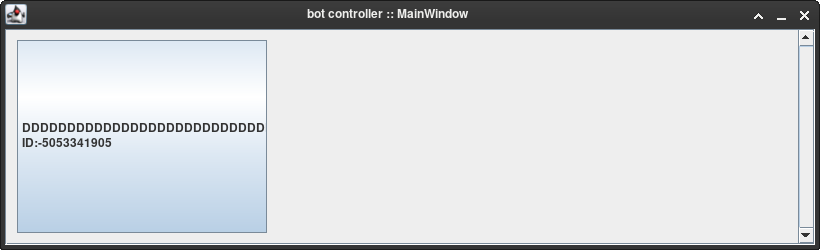
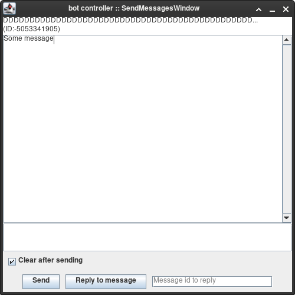
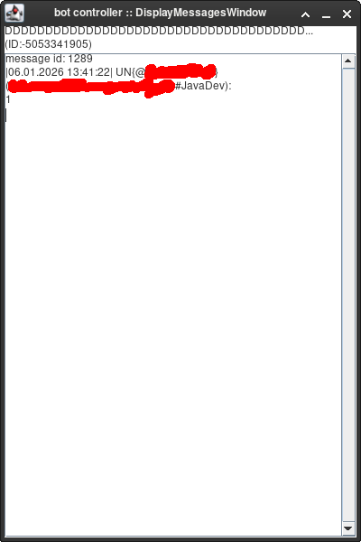

# Telegram bot controller

# WARNING
You cant see other bots messages (you can only if a user replied to a bot)

**Never** run more than one ***bot application*** on one ***bot*** at the same time

## Launching
1) You can import this project into your IDE and add a run configuration
2) You can compile it using mvn package command

Launching args:
1) bot USERNAME, but **WITHOUT the '@' symbol**
2) bot token

## After you launched it
You will see MainWindow with all chats where bot gets messages

If you click on a chat, it will open SendMessagesWindow and DisplayMessagesWindow

### SendMessagesWindow
You can type your message inside the big text area

To send message regularly press "Send" button

To send message with replying to user, you need to fill in the "Message id to reply" field, and press "Reply to message" button

After sending a message, you will see output like "Message sent" or a telegram API error
### DisplayMessagesWindow
Here you can see all the messages that were sent to bot, and also live messages that are sent now

### To fully close the program, you need to close the MainWindow

# Screenshots

